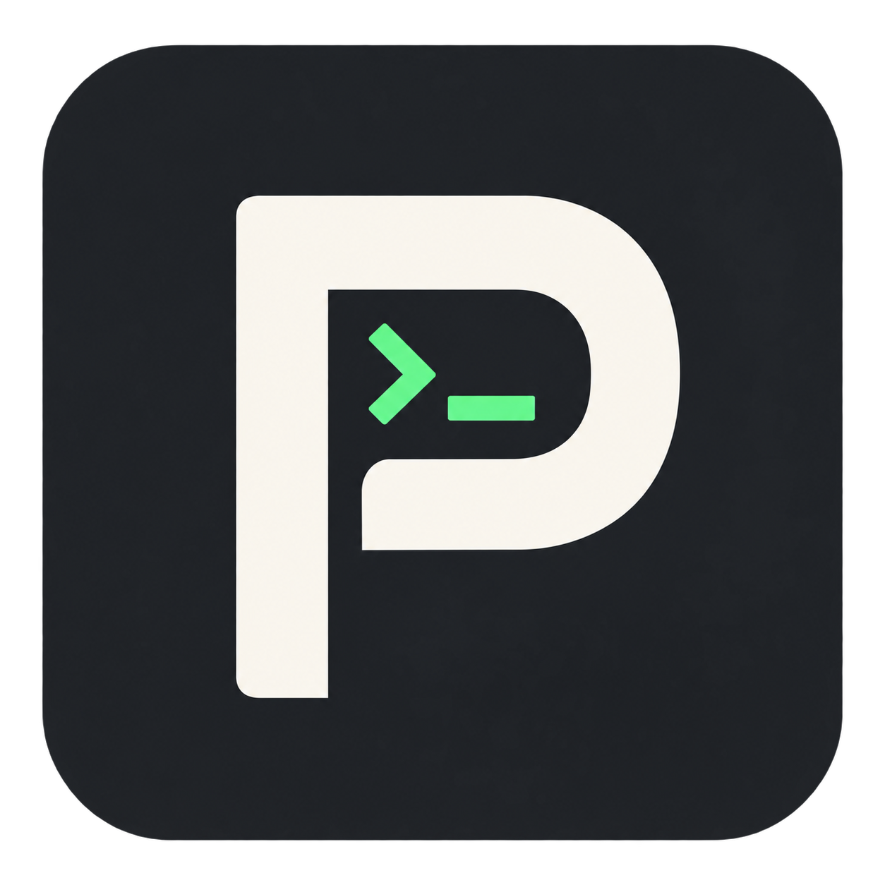

> 2026-09-17：本机已停用 Paseo，29 个会话已归档。此仓库保留定制源码与历史验证记录，下面的功能说明不表示服务仍在线。

<p align="center">
  
</p>

<h1 align="center">Paseo Bridge</h1>

<p align="center">以 Paseo 为入口，按角色协调多个 CLI Agent</p>

基于 [getpaseo/paseo](https://github.com/getpaseo/paseo)。新框架使用 **Paseo Bridge** 名称：
Paseo 客户端处理需求与验收，daemon 提供有边界的原生任务接口，管理 CLI 子会话与 Relay。
此前 Paseo Lite 的后台裁剪继续保留；历史桌面包、协议、npm 包名和 `~/.paseo` 数据目录不做破坏性改名。

## 当前入口

公司电脑和手机继续使用 Paseo，主会话可选已配置的 Codex、Claude、OpenCode 或 ACP Provider。
任务协调现已接入 daemon 的 `task` / `task_roles`，执行者是可以直接管理的原生子会话。
主会话提交后结束当前轮，由后台保存完成状态、空闲通知及有界结果，避免持续短时轮询。

上下文优化包括角色入口按需加载、项目合同受控读取、有限追加预算、精简工具结果和无损紧凑证据。
实现、迁移范围与验证限制见 [原生任务](docs/native-tasks.md)。旧独立 Bridge 和轻量面板已退役，历史任务数据保留，
历史桌面包不追溯改名；真实业务的token/订阅节省仍需同等任务对照。

## 使用场景

| 设备         | 运行方式                                        |
| ------------ | ----------------------------------------------- |
| 家里 WSL     | Paseo daemon、CLI 与原生任务协调端              |
| 公司 Windows | Paseo 客户端与本地执行主机；通过 Relay 访问家里 |
| 手机         | 原版 Paseo App，使用 Relay 访问主机             |

两台主机各自保存项目、凭据、角色与会话；原生任务记录保存在执行 daemon，不自动跨主机复制。
公司没有罗盘项目时只需更新免安装包；通过 Relay 使用 WSL 罗盘无需在公司复制项目规则。

## 我们定制了什么

### 功能裁剪

| 功能               | 定制后的行为                                                                                                   |
| ------------------ | -------------------------------------------------------------------------------------------------------------- |
| 语音、听写、播报   | 轻量配置关闭语音能力；定制 Web/Electron 移除入口。全部禁用时不初始化语音服务、不下载模型、不建立恢复计时器     |
| 内嵌浏览器         | Electron 禁用 webview，移除浏览器桥接及新建入口；已有浏览器标签保留链接，可用系统浏览器打开                    |
| Provider           | 默认启用 Claude Code、Codex、OpenCode，保留 Cursor 和自定义 ACP；Copilot、Pi、OMP 默认关闭，适配器与协议仍保留 |
| 插件与公开服务代理 | 轻量配置默认关闭；保留扩展契约及本地工作区服务路由                                                             |
| 自动归档           | 轻量配置关闭合并后自动归档                                                                                     |
| 多窗口             | 定制桌面复用一个窗口，保留工作区标签、终端、文件、diff、审批和通知                                             |
| 上游自动更新       | Lite 不查询或安装上游桌面更新，避免覆盖定制功能；更新需手动替换定制包                                          |

Cursor 模板使用 `cursor-agent acp`，需要主机安装支持 ACP 的对应 CLI；保留适配器不代表本机已安装。所有 Provider 都需要各自的 CLI 与登录配置，Paseo 不附带模型账号。

### 后台优化

- **文件监听按需持有**：侧栏不再持续占用递归工作树监听；文件或 diff 面板需要时获取订阅，关闭后释放，保留仓库身份与元数据检测。
- **隐藏面板减少请求**：隐藏的 Git/PR 面板不因缓存失效继续查询，重新显示时获取最新状态。
- **关闭自动远端刷新**：停止启动时及周期性的 `git fetch`，取消后台 PR/CI 定时轮询；手动 Git 操作仍保留。刷新 UI 不等于拉取远端引用。
- **减少空闲计时器**：无服务路由时不做探活；没有可运行调度任务时不保留调度计时器；健康监听器不再周期性重复初始化。
- **后台 agent 保持独立**：默认关闭桌面窗口后 daemon 继续运行；已有明确的退出设置仍受尊重，不按客户端连接数量停止 agent。

侧栏状态可能暂时使用缓存。Hub、调度与历史数据没有被直接删除；不把“当前未使用”当作永久移除功能。

### 会话与界面优化

- **整轮过程自动折叠**：回答完成后收起中间说明、思考、工具调用与任务清单，保留最终回答和通知；可随时展开，历史数据不删除。
- **Codex 原生会话改名**：在 Paseo 修改 Codex 会话标题时，同步写入 Codex 原生会话，运行中和已关闭的会话均支持。原生改名失败会报错；目前是 Paseo → Codex 的同步，不是所有 Provider 的双向标题监听。
- **Claude 浅色主题**：暖白背景、深色正文、陶土橙强调色，代码与终端配色一并调整。
- **Windows 新图标**：炭黑底、浅色 P 与绿色终端符号，覆盖程序、窗口及安装器图标。

折叠和主题属于定制客户端改动，原版手机 UI 不随 daemon 更新而改变；Codex 改名同步需要主机运行新版 daemon。

### Lite.3–Lite.6 新增优化

- **常用设置＋高级设置**：保留连接、配对、Agent、权限等入口，低频项折叠；清理停用插件、语音及内嵌浏览器的残留运行路径。
- **桌面交互**：缩小 Windows 原生厚边框，Agent 标签右键可归档，Alt+Enter 在光标处换行。
- **减少额外模型调用**：自动工作区标题改用首条消息摘要，不再调用模型生成标题或分支名；手动改名保留。
- **控制各 Provider 的上下文增长**：共用按需阅读约束；新增工作区文档分段读取、JSON 快照字段筛选和重复内容省略工具，覆盖 Claude、Codex、OpenCode、Cursor/通用 ACP 与自定义角色。Codex 修复配置恢复路径，保留默认 4000 原生工具结果预算；这不是所有 Provider 原生工具的统一硬上限。保留角色与交叉复核要求，详见[排查记录](docs/codex-context-audit.md)。
- **复用委派会话**：模型通过 MCP 使用稳定 taskId/role 时，按父会话、工作区、任务、角色返回已有子会话，并防止并发重复创建；复用不会重发初始任务。新一轮独立复核使用新任务标识，避免旧结论影响独立性。
- **加密终端截图粘贴**：剪贴板图片使用 Blob 存储，减少临时 PNG 文件读写；上传前校验图片可解码，失败不再静默丢弃附件。Codex 适配器使用原生 image/data URL 输入。已通过 Windows 粘贴、重载和字节一致性验证，用户已确认公司加密环境可传图；旧坏附件需要删除后重新粘贴。

## 保留的核心能力

Relay 与端到端加密、多主机配对、会话创建/发送/中断/审批、历史与归档、项目和工作区、worktree、终端、文件浏览、diff 以及完成/待审批通知。手机协议保持兼容；端到端的设备验收进度见下文。

## 使用定制版

### Windows 免安装包

当前交付文件为 `Paseo-Lite-0.8.0-lite.10-x64.zip`。公司电脑本地运行 Agent 时，也必须替换完整包以更新内置 daemon；只连接新版 WSL 的客户端可继续使用旧包。**完整解压后运行 `Paseo.exe`**，不能只拷贝一个 EXE。添加主机时粘贴目标 daemon 生成的完整 Relay 配对链接。

ZIP 无需安装，但配置与会话仍写入用户目录，不是数据随 ZIP 一起移动的便携模式。包不包含主机的账号凭据或配对信息。

当前定制包为本地构建交付，未作为本轮 GitHub Release 或 npm 包发布。上游下载页、上游 Docker 镜像和 `npm install -g @getpaseo/cli` 提供的是上游版本，不能用来获取本仓库的定制改动。

### WSL / 无桌面主机

使用本仓库构建的 daemon/CLI，沿用主机的 `~/.paseo`。升级前备份配置、身份、项目与会话；停止旧 daemon 后再启动新版，避免两份程序竞争同一数据目录。

[config/lightweight.json](config/lightweight.json) 是轻量配置模板：

- 已有主机只合并对应字段，保留 Relay 地址、身份、环境变量、角色预设和自定义 Provider；不要整文件覆盖旧配置。
- Lite 桌面首次启动会合并模板、备份旧配置并写入一次性标记，后续启动不重复覆盖用户设置。
- 手动部署 daemon 时需要自行合并模板；配置还可能被已有环境变量覆盖。
- daemon 启动环境必须能找到所需 agent CLI，尤其检查 WSL 的 Node 工具目录是否在 PATH 中。

在已经配置 `paseo-lite` 入口的主机上：

```bash
paseo-lite daemon start
paseo-lite daemon pair --relay
paseo-lite ls
```

手机扫码，公司客户端粘贴配对链接，即可连接同一台 WSL 主机。

## 从源码构建

已验证的构建环境使用 Node.js 22.22.1。仓库采用 npm workspaces：

```bash
npm ci
npm run build:server
npm run build:desktop:lite
```

`build:desktop:lite` 构建 daemon/CLI、桌面 UI 和 Windows x64 NSIS/ZIP，使用 [轻量打包配置](packages/desktop/electron-builder.lightweight.yml)，输出到 `packages/desktop/release-lite/`，不自动发布网站、手机包或 Release。

Windows 打包还依赖 Electron Builder 对应平台工具；Linux/WSL 跨平台构建可能需要 Wine 或 Windows 侧资源编辑与封装，不能把未经核验的中间目录当作最终交付。构建过程与已验证边界见 [Windows 桌面评估](docs/windows-desktop-evaluation.md) 和 [定制计划](docs/customization-plan.md)。

## 验证状态与限制

- 已完成各批定向测试、工作区类型检查、lint、服务端构建和 Electron UI 导出；lite.2 的会话、主题及 Codex 改名相关测试共 363 项通过。
- 已验证 Windows 安装/解压产物、UI 与托管 daemon 启动，以及通过公网 Relay 读取 WSL 状态。
- 公司加密终端截图粘贴已获用户确认；原版手机与公司网络下的完整审批、重连、通知矩阵仍需设备联调；尚未完成同负载的原版/定制版完整性能对照。
- CLI 的部分状态探测期限只有 1500 ms，公网 Relay 握手较慢时可能误报不可达；不要据此直接重启 daemon。

本仓库描述通用定制能力。个人角色分工、项目研究工作流、模型凭据与主机配对信息由各主机/项目维护，不作为通用默认配置分发。

## 文档与来源

- [定制范围、实施记录与验收](docs/customization-plan.md)
- [Windows 桌面方案评估](docs/windows-desktop-evaluation.md)
- [系统架构](docs/architecture.md) · [开发指南](docs/development.md)
- [Provider 扩展](docs/providers.md) · [自定义 ACP Provider](docs/custom-providers.md)
- [上游 Paseo](https://github.com/getpaseo/paseo)

感谢上游 Paseo 项目。保留原作者版权声明，许可见 [LICENSE](LICENSE)（Apache-2.0；第三方组件遵循各自许可）。
